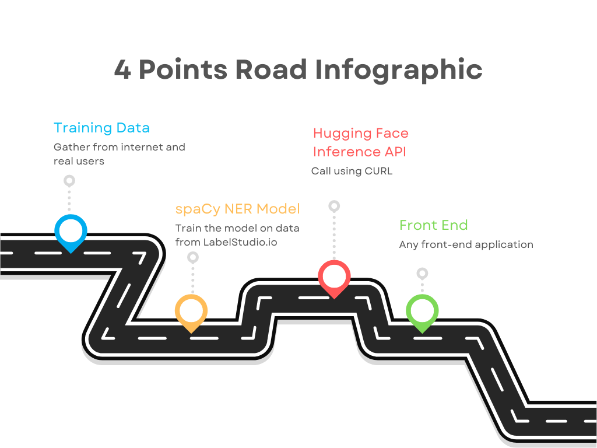

## Hi there 👋

Welcome to COFF-E: Coffee at the Speed of Sound, this project, to develop a Natural Language Processor for coffee was the hardwork of five students for the University of Rochester in Computer Science 212 Human Computer Interaction

Our main Machine Learning Model is located here: [Try our model!](https://huggingface.co/cbruinsm/en_Coff_Ev1?text=brown+sugar+and+vanilla+3+shot+oatmilk+shaken+espresso+with+pumpkin+cream+foam+and+whipped+cream+and+carmel+syrup+and+tall+no+water+no+foam+with+three+pumps+of+raspberry+and+an+upside+down%2C+carmel+macchiato+with+extra+caramel+drizzle)

Thank you for visiting!

